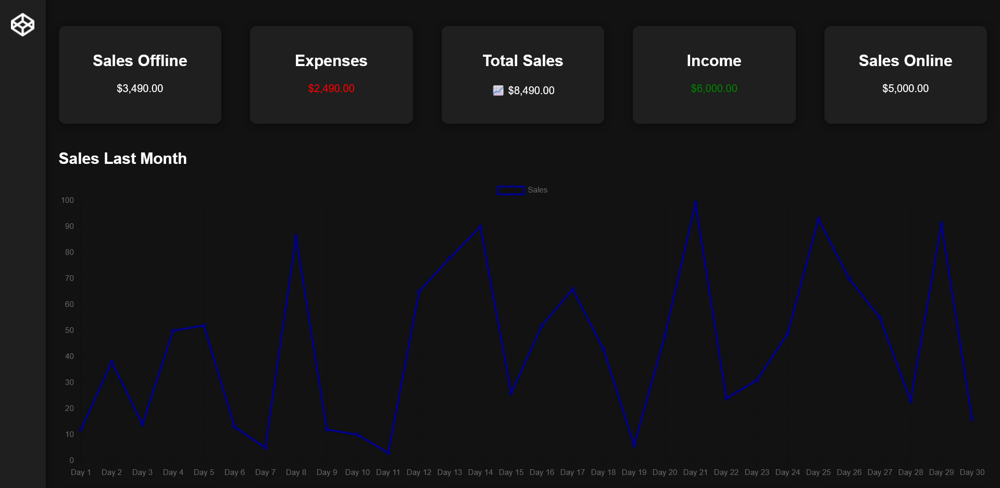
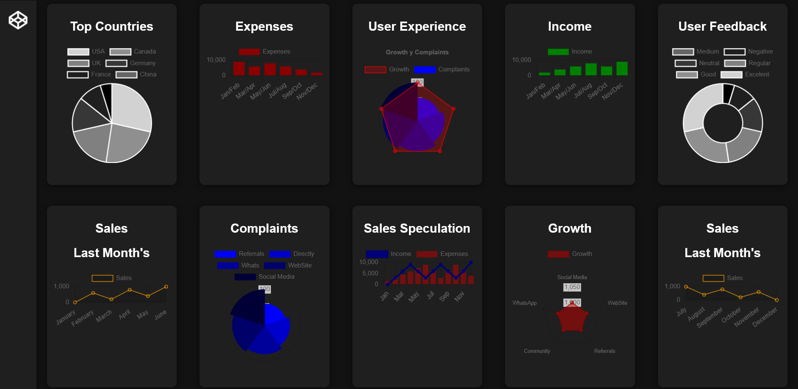

# 📊 Dashboard de Data Analysis con Chart.js echo en HTML, CSS, y JS 





## 📌 **Características Principales**

Este proyecto es un **Dashboard de Data Analysis** para el análisis de datos financieros y de usuario. Permite visualizar información clave a través de tarjetas y gráficos, facilitando la toma de decisiones basadas en datos.

---

## 📂 **Estructura del Proyecto**

```
📁 Dashboard
├── 📄 Index.html  # Estructura y contenido del dashboard
├── 🎨 Style.css   # Estilos y diseño del dashboard
├── 📜 Index.js    # Lógica e interactividad con gráficos
├── 📄 README.md   # Documentación del proyecto
```

---

## 🏗 **Instalación y Uso**

### 🔹 **Requisitos Previos**
Para ejecutar este dashboard solo necesitas un navegador web .

### 🔹 **Instrucciones de Uso**
1. **Descarga o clona** este repositorio.
2. Abre `Index.html` en tu navegador favorito.
3. Interactúa con la pagina web.

---

## 🎨 **Detalles del Diseño**

- **Tema oscuro** con colores contrastantes para mejor visibilidad.
- **Navegación lateral dinámica** que se oculta y expande automáticamente.
- **Diseño responsivo** con media queries en CSS para adaptabilidad a distintos dispositivos.
- **Sombreado y transiciones suaves** para una experiencia visual atractiva.

---

## 📊 **Gráficos Disponibles**

Los datos del dashboard se presentan en distintos gráficos creados con **Chart.js**:

- 📈 **Ventas del Último Mes** *(Gráfico de Líneas)*
- 🌍 **Principales Países** *(Gráfico de Pastel)*
- 💰 **Gastos Anuales** *(Gráfico de Barras)*
- 📊 **Experiencia del Usuario** *(Gráfico Polar)*
- 🏦 **Ingresos Anuales** *(Gráfico de Barras)*
- 🗣 **Retroalimentación del Usuario** *(Gráfico de Radar)*
- 📊 **Especulación de Ventas** *(Gráfico Mixto - Barras y Líneas)*
- 📉 **Quejas de Usuarios** *(Gráfico de Barras)*

---

## ⚙️ **Archivos del Proyecto**

### 📄 `Index.html`
Define la estructura del dashboard:
- Barra de navegación lateral.
- Tarjetas de información financiera.
- Contenedores para los gráficos.
- Pie de página con enlaces sociales.

### 🎨 `Style.css`
Gestiona los estilos y la responsividad:
- Paleta de colores oscuros.
- Transiciones suaves en la barra de navegación.
- Tarjetas y widgets con efectos visuales.

### 📜 `Index.js`
Añade interactividad y funcionalidad:
- Inicialización de los gráficos con datos.
- Eventos para mejorar la experiencia del usuario.
- Posible integración con bases de datos para datos dinámicos.

---


## 📝 **Licencia**

Este proyecto está licenciado bajo la [Licencia GNU](LICENSE).

---
